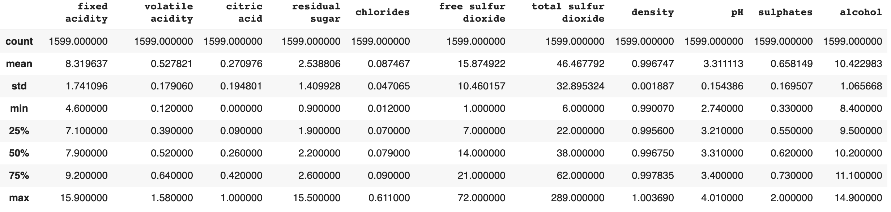
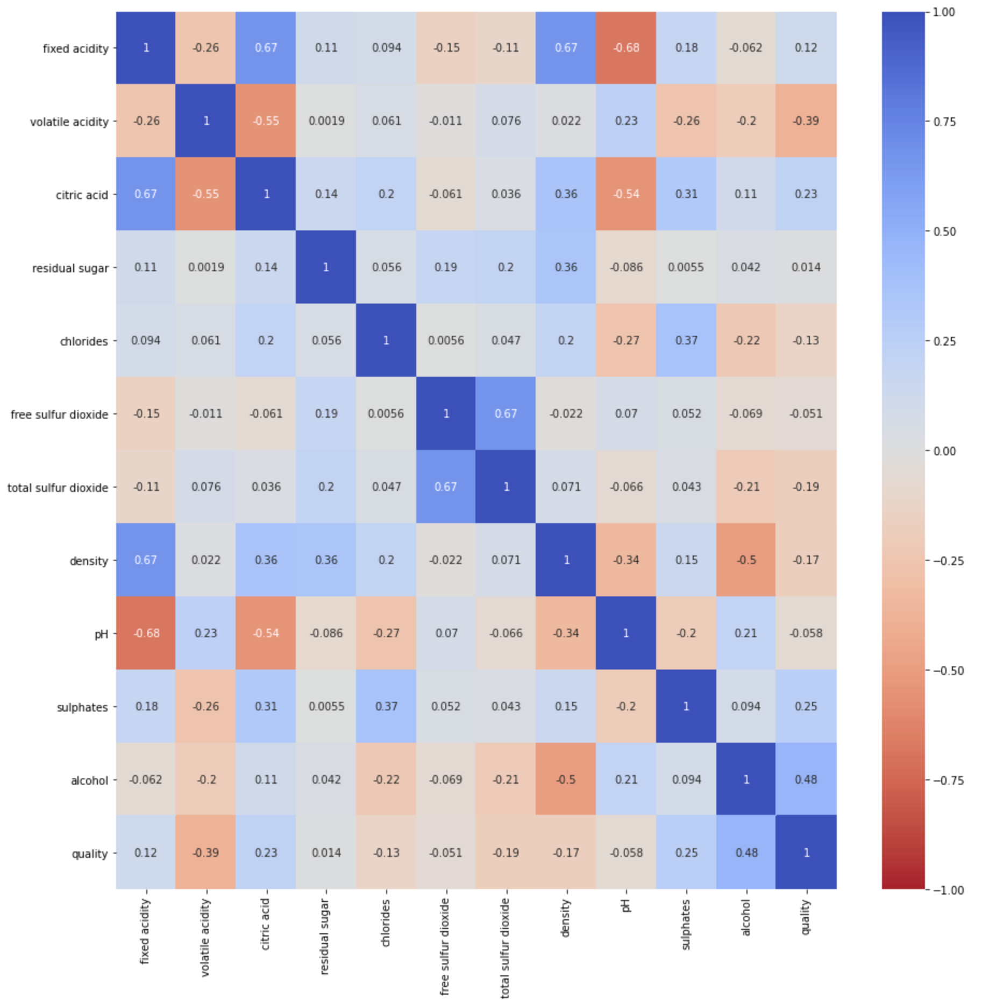
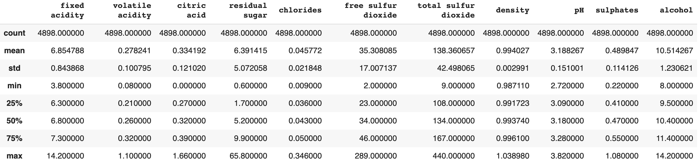
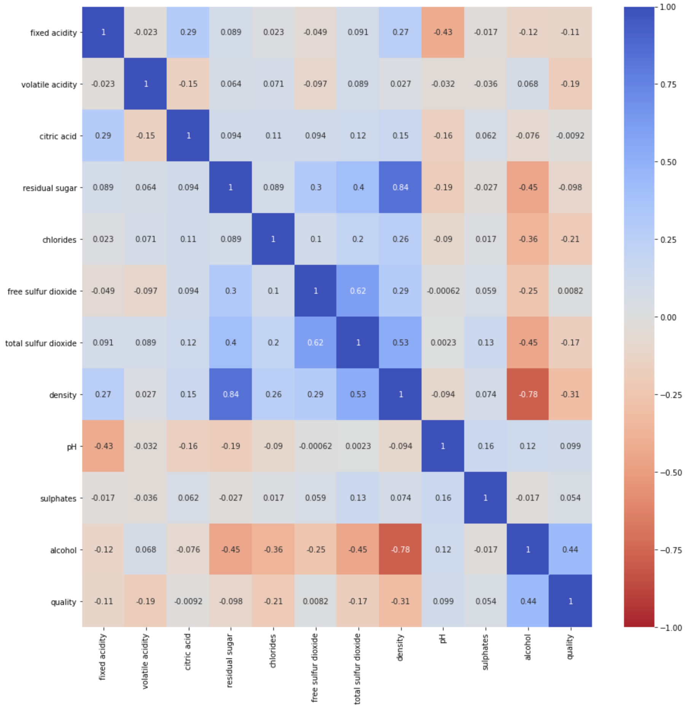
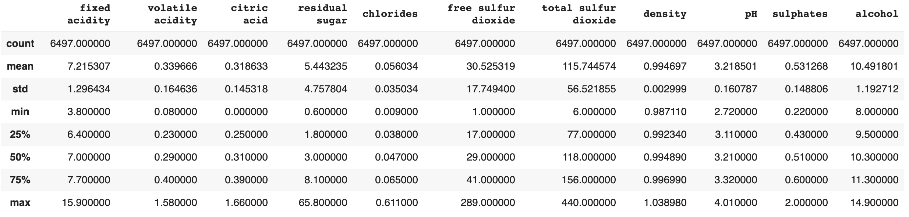
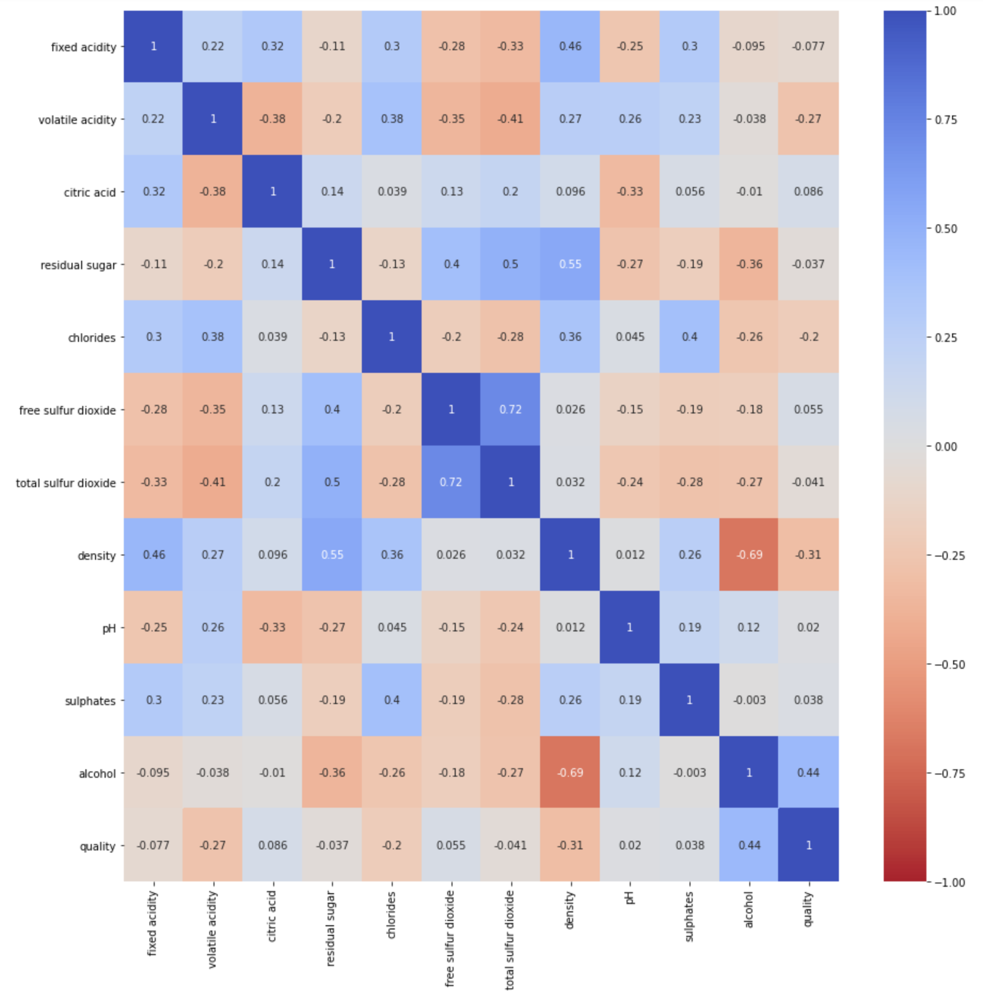
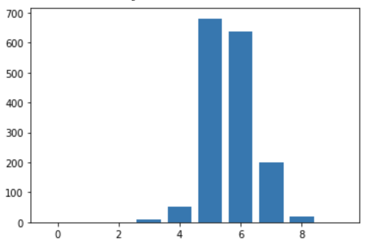
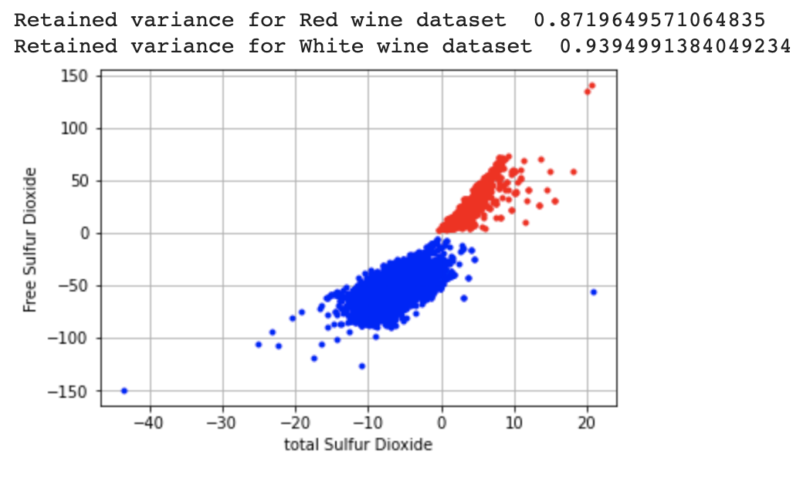
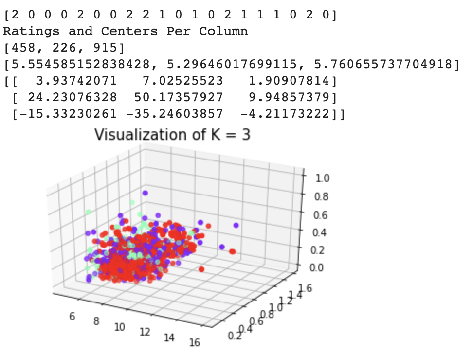
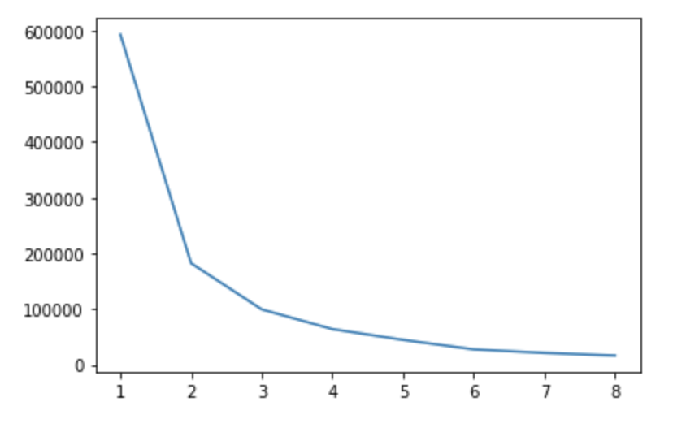

# No Wine Left Behind

## By Alex Karwoski, August Stapf, Thomas Robinson, and Michael Bick

### Introduction

While seeing relatives out in Oregon, one of our initial group members, Michael Leon, went around visiting vineyards and wineries in the Oregon countryside with his uncle. His uncle taught him the ins and outs of wine tasting, and what makes certain wines different from others in taste, quality, and other aspects. As we were looking around at public datasets to do our project, we came across the wine dataset, and after we heard his story, we were curious if wine quality could be determined based on the chemical components of the wine, as opposed to just a connoisseur's taste. All of our group members showed an interest in the topic, and we were all in to do our project on wine.
 
Previous work using machine learning on the wine dataset is extensive in the literature [1-3]. Varied techniques have been used: from common classification techniques like k-nearest neighbors, random forests, and SVMs [2], to uncommon techniques like fuzzy ones [1,3]. In our project, we benchmark these techniques against more modern ones.
 
First, the team uses statistical methods to analyze the data and perform principal component analysis (PCA). Then, the team uses the best features from PCA in various classification and regression algorithms. Method one implements the k-means algorithm, where the assigned cluster mean is used to predict a wine's quality. Algorithm 2 is an implementation of ridge regression on the wine quality values. Technique 3 is a decision tree implementation that classifies the wine qualities based on groups of “bad” and “good” quality.
 
Together, these techniques demonstrate a comprehensive analysis of modern machine learning techniques on the wine dataset. Overall, we hope the methods we develop during this project enable classifying wines qualitatively rather than subjectively. These models can be used to make business decisions on the variable inputs that companies need to consider when bringing a new wine to market. They can reduce the amount of research and development costs necessary to develop new varieties of wine. Additionally, they could be used to aid wine sellers in pricing their products. The value of the wine industry makes this project very useful to those who may want to consider a scientific approach to man

[1] Escobet, Antoni, et al. “Modeling Wine Preferences from Physicochemical Properties Using Fuzzy 
Techniques .” Scitepress, pp. 1–7.

[2] Er, Yeşim & Atasoy, Ayten. (2016). The Classification of White Wine and Red Wine According to 
Their Physicochemical Qualities. International Journal of Intelligent Systems and Applications in Engineering. 23-23. 10.18201/ijisae.265954.

[3] P. Cortez, A. Cerdeira, F. Almeida, T. Matos and J. Reis. Modeling wine preferences by data mining 
from physicochemical properties. In Decision Support Systems, Elsevier, 47(4):547-553. ISSN: 0167-9236.

```python
import numpy as np
import pandas as pd
import matplotlib.pyplot as plt
import seaborn as sns

# %matplotlib inline
```
**Dataset**

The dataset contains the wine attributes: Fixed Acidity, Volatile Acidity, Citric Acid, Residual Sugar, Chlorides, Free Sulfur Dioxide, Total Sulfur Dioxide, Density, pH, Sulphates, Alcohol(% ABV), and the Quality. In conductiing our tests, we want to determine which of the attributes are more important in determining the quality of wine than others.

**Sample Data**

Below is an example of what the data for the physiochemical properties of the wine looks like. The first 11 columns are the separate chemical properties that we will be analyzing to see how they relate to the overall wine which is in the last column.

```python
red_dataframe = pd.read_csv('winequality-red.csv', sep=';')
red_dataframe.head()
```


**Red Wine Information and Correlation Matrix**

Here we have information on each of the individual attributes of the red wines. The following information shows us the Averge, Standard Deviation, Min, Max, etc. Below that is the Correlation of each attribute to each other attribute

```python
red_dataframe = pd.read_csv('winequality-red.csv', sep=';')
red_dataframe.drop('quality', axis=1).describe()
```


```python
correlation = red_dataframe.corr()
fig, ax = plt.subplots(figsize=(15,15))
sns.heatmap(correlation, xticklabels=correlation.columns, yticklabels=correlation.columns, cmap='coolwarm_r', vmin=-1, vmax=1, annot=True, ax=ax)
```


**White Wine Information and Correlation Matrix**

Here we have information on each of the individual attributes of the white wines. The following information shows us the Averge, Standard Deviation, Min, Max, etc. Below that is the Correlation of each attribute to each other attribute

```python
white_dataframe = pd.read_csv('winequality-white.csv', sep=';')
white_dataframe.drop('quality', axis=1).describe()
```




```python
correlation = white_dataframe.corr()
fig, ax = plt.subplots(figsize=(15,15))
sns.heatmap(correlation, xticklabels=correlation.columns, yticklabels=correlation.columns,cmap='coolwarm_r', vmin=-1, vmax=1, annot=True, ax=ax)
```



**Combined Wine Information and Correlation Matrix**

Here we have information on each of the individual attributes of the combined red and white wines. The following information shows us the Averge, Standard Deviation, Min, Max, etc. Below that is the Correlation of each attribute to each other attribute

```python
both = [red_dataframe, white_dataframe]
both_dataframe = pd.concat(both)
both_dataframe.drop('quality', axis=1).describe()
```


```python
correlation = both_dataframe.corr()
fig, ax = plt.subplots(figsize=(15,15))
sns.heatmap(correlation, xticklabels=correlation.columns, yticklabels=correlation.columns,cmap='coolwarm_r', vmin=-1, vmax=1, annot=True, ax=ax)
```


The correlation matrix was made in order to help visualize the mean and standard deviation of each feature with respect to the quality variable. Using it, one can determine the correlations between various feature’s and a blend of wine’s quality. Qualitatively, correlation coefficient with magnitude greater than 0.2 show features that have strong predictive power. For the red wine data set alone, the features that have a perceived relationship of some type with the quality rating are volatile acidity, alcohol content, citric acid, and sulphates. For the wine data set alone, the features that have a perceived relationship with the quality rating are chlorides, density, and alcohol content. Already we can see that the two types of wine may need to be analyzed separately in order to create an accurate model, but we will still consider the full data set of both types. The full data set shows strong correlation of volatile acidity, chlorides, density, and alcohol content with the quality rating of the wine.

### Import Data

```python
from __future__ import absolute_import
from __future__ import print_function
from __future__ import division

# %matplotlib inline  
```


```python
import sys
from math import *
import matplotlib
import numpy as np
import matplotlib.pyplot as plt
from mpl_toolkits.mplot3d import axes3d
from tqdm import tqdm
import os
from scipy import ndimage, misc
from matplotlib import pyplot as plt
import numpy as np
import imageio
from sklearn.datasets import load_boston, load_diabetes, load_digits, load_breast_cancer, load_iris, load_wine
# %matplotlib inline
from sklearn.cluster import KMeans


data_red=np.genfromtxt("RedWine.csv", delimiter=',')
X_red = data_red[1:,:-1]
Y_red = data_red[1:,-1]


data_white=np.genfromtxt("WhiteWine.csv", delimiter=',')
X_white = data_white[1:,:-1]
Y_white = data_white[1:,-1]
```

### PCA

**Data Distribution**

```python
buckets = [0] * 10

for i in range(len(Y_red)):
  buckets[int(Y_red[i])] += 1

plt.bar(range(len(buckets)), buckets)
```


```python
def plot_curve(x, y, color, label_x, label_y, curve_type='.', lw=2):
    plt.plot(x, y, curve_type, color=color, linewidth=lw, )
    plt.xlabel(label_x)
    plt.ylabel(label_y)
    plt.grid(True)
```

```python
def pca(X):
    """
    Decompose dataset into principal components. 
    You may use your SVD function from the previous part in your implementation.
    
    Args: 
        X: N*D array corresponding to a dataset
    Return:
        U: N*N 
        S: min(N, D)*1 
        V: D*D
    """
    U, s, VT = np.linalg.svd(X)
    return U, s, VT
   
def intrinsic_dimension(S, recovered_variance=.99):
    """
    Find the number of principal components necessary to recover given proportion of variance
    
    Args: 
        S: 1-d array corresponding to the singular values of a dataset
        
        recovered_varaiance: float in [0,1].  Minimum amount of variance 
            to recover from given principal components
    Return:
        dim: int, the number of principal components necessary to recover 
            the given proportion of the variance
    """
    x = 0
    k = 0
    closed_list = []
    print(S.shape)
    open_list = np.copy(S).tolist()

    while x < .99:
      k = k + 1
      a = np.max(open_list)
      open_list.remove(a)  
      closed_list.append(a)
      x  = sum(closed_list)/sum(S)
    return k

def num_linearly_ind_features(S, eps=1e-11):
    """
    Find the number of linearly independent features in dataset
    
    Args: 
        S: 1-d array corresponding to the singular values of a dataset
    Return:
        dim: int, the number of linearly independent dimensions in our data
    """
    count = 0
    for val in S:
      if val > eps:
        count = count + 1
    return count
```

```python
def visualize(X,y, color, x_label, y_label):
  """
  Args:
  X: NxD numpy array, where N is number 
          of instances and D is the dimensionality of each 
          instance
  y: numpy array (N,), the true labels
  
  Return:
  retained variance: scalar
  """
  U, s, VT = np.linalg.svd(X)
  proj = VT[:,0:2]
  data = X @ proj
  plot_curve(data[:,0],data[:,1], color, x_label, y_label)


  return np.sum(s[0:2])/np.sum(s)
```

```python
#Use PCA for visualization of  wine data

retained_variance_for_wine=visualize(X_red,Y_red, 'r', 'Total Sulfur Dioxide','Free Sulfur Dioxide')
print("Retained variance for Red wine dataset ",retained_variance_for_wine)

retained_variance_for_wine=visualize(X_white,Y_white,'b','total Sulfur Dioxide','Free Sulfur Dioxide')
print("Retained variance for White wine dataset ",retained_variance_for_wine)
```


Base on the groupings on the above graph, it is evident that the two principal features among the wines differ significantly.


**Perform PCA on Data**

```python
def rmse(pred, label): 
    '''
    This is the root mean square error.
    Args:
        pred: numpy array of length N * 1, the prediction of labels
        label: numpy array of length N * 1, the ground truth of labels
    Return:
        a float value
    '''
    dif = pred - label
    dif = dif**2
    dif = dif/len(pred)
    sum_dif =sum(dif)
    return np.sqrt(sum_dif)
```

```python
class LinearReg(object):
    @staticmethod 
    # static method means that you can use this method or function for any other classes, it is not specific to LinearReg
    def fit_closed(xtrain, ytrain):
        """
        Args:
            xtrain: NxD numpy array, where N is number 
                    of instances and D is the dimensionality of each 
                    instance
            ytrain: Nx1 numpy array, the true labels
        Return:
            weight: Dx1 numpy array, the weights of linear regression model
        """
        x = xtrain.T  @ xtrain
        x = np.linalg.inv(x) @ xtrain.T 
        x = x @ ytrain
        return x

    def predict(xtest, weight):
        """
        Args:
            xtest: NxD numpy array, where N is number 
                   of instances and D is the dimensionality of each 
                   instance
            weight: Dx1 numpy array, the weights of linear regression model
        Return:
            prediction: Nx1 numpy array, the predicted labels
        """
        
        return xtest @ weight
```

```python
class RidgeReg(LinearReg):

    @staticmethod
    def fit_closed(xtrain, ytrain, c_lambda):
      m,n = xtrain.shape
      I = np.eye((n))
      G = c_lambda * I
      G[0,0] = 0
      return (np.linalg.inv(xtrain.T @ xtrain + G) @ xtrain.T @ ytrain)
```

```python
#apply PCA on the dataset and also find the number of linearly independent and intrinsic components 
def apply_PCA_on_data(X):
  """
  Args:
  X: NxD numpy array, where N is number 
          of instances and D is the dimensionality of each 
          instance
  Return:
  X_pca: pca reduced dataset
  independent_features: number of independent features 
  intrinsic_dimensions: number of intrinsic dimensions
  """
  
  U, s, VT = np.linalg.svd(X)
  k = intrinsic_dimension(s)
  proj = VT[:,0:k]
  data = X @ proj
  return data, num_linearly_ind_features(s), k
```

```python
def apply_regression(X_train,y_train,X_test):
  """
  Args:
  X_train: training data without labels
  y_train: training labels
  X_test: test data 

  Return:
  y_pred: predicted labels
  """
  w = RidgeReg.fit_closed(X_train, y_train, c_lambda = 0)
  return X_test @ w
```

**Cross Validation**

```python
def cross_validation(X, y, kfold, c_lambda):
    X_groups = np.split(X, kfold, axis = 0)
    Y_groups = np.split(y, kfold, axis = 0)
    r = 0
    for i in range(kfold):
      w = RidgeReg.fit_closed(X, y, c_lambda)
      y_pred = RidgeReg.predict(X_groups[i], w)
      r += rmse(y_pred, Y_groups[i])   
    return r/kfold     
    
X_redCV = X_red[:-9]
Y_redCV = Y_red[:-9]

best_lambda = None
best_error = None
kfold = 10
lambda_list = [0, 0.1, 1, 5, 10, 100, 1000]
for lm in lambda_list:
    err = cross_validation(X_redCV, Y_redCV, kfold, lm)
    print('lambda: %.2f' % lm, 'error: %.6f'% err)
    if best_error is None or err < best_error:
        best_error = err
        best_lambda = lm


print('best_lambda for Red Wine: %.2f' % best_lambda)
weight = RidgeReg.fit_closed(X_redCV, Y_redCV, c_lambda=10)
y_test_pred = RidgeReg.predict(X_redCV, weight)
test_rmse = rmse(y_test_pred, Y_redCV)
print('test rmse: %.4f' % test_rmse)
```
> lambda: 0.00 error: 0.646135 <br/>
> lambda: 0.10 error: 0.646210 <br/>
> lambda: 1.00 error: 0.648945 <br/>
> lambda: 5.00 error: 0.654520 <br/>
> lambda: 10.00 error: 0.657310 <br/>
> lambda: 100.00 error: 0.677917 <br/>
> lambda: 1000.00 error: 0.704367 <br/>
> best_lambda for Red Wine: 0.00 <br/>
> test rmse: 0.6585 <br/>

```python
def cross_validation(X, y, kfold, c_lambda):
    X_groups = np.split(X, kfold, axis = 0)
    Y_groups = np.split(y, kfold, axis = 0)
    r = 0
    for i in range(kfold):
      w = RidgeReg.fit_closed(X, y, c_lambda)
      y_pred = RidgeReg.predict(X_groups[i], w)
      r += rmse(y_pred, Y_groups[i])   
    return r/kfold   

    
X_whiteCV = X_white[:-8]
Y_whiteCV = Y_white[:-8]

best_lambda = None
best_error = None
kfold = 10
lambda_list = [0, 0.1, 1, 5, 10, 100, 1000]
for lm in lambda_list:
    err = cross_validation(X_whiteCV, Y_whiteCV, kfold, lm)
    print('lambda: %.2f' % lm, 'error: %.6f'% err)
    if best_error is None or err < best_error:
        best_error = err
        best_lambda = lm


print('best_lambda for White Wine: %.2f' % best_lambda)
weight = RidgeReg.fit_closed(X_whiteCV, Y_whiteCV, c_lambda=10)
y_test_pred = RidgeReg.predict(X_whiteCV, weight)
test_rmse = rmse(y_test_pred, Y_whiteCV)
print('test rmse: %.4f' % test_rmse)
```
> lambda: 0.00 error: 0.753389 <br/>
> lambda: 0.10 error: 0.753396 <br/>
> lambda: 1.00 error: 0.753554 <br/>
> lambda: 5.00 error: 0.754501 <br/>
> lambda: 10.00 error: 0.755552 <br/>
> lambda: 100.00 error: 0.767648 <br/>
> lambda: 1000.00 error: 0.786491 <br/>
> best_lambda for White Wine: 0.00 <br/>
> test rmse: 0.7577 <br/>


**PCA For every Group - Red Wine**

```python
X_red_ratings = [[]]
Y_red_ratings = [[]]
for i in range(10):
  X_red_ratings.append([])
  Y_red_ratings.append([])

for i in range(len(Y_red)):
  rating = int(Y_red[i])
  X_red_ratings[rating].append(X_red[i])
  Y_red_ratings[rating].append(Y_red[i])

X_red_ratings = np.asarray(X_red_ratings)
Y_red_ratings = np.asarray(Y_red_ratings)

for i in range(10):
  if(len(X_red_ratings[i]) > 0):
    X_PCA, ind_features, intrinsic_dimensions = apply_PCA_on_data(X_red_ratings[i])
    print("data shape with PCA ",X_PCA.shape)
    print("Number of independent features ",ind_features)
    print("Number of intrinsic components ",intrinsic_dimensions)

    #get training and testing data 
    X_train=X_PCA[:int(0.8*len(X_PCA)),:]
    y_train=np.asarray(Y_red_ratings[i])[:int(0.8*len(X_PCA))].reshape(-1,1)
    X_test=X_PCA[int(0.8*len(X_PCA)):]
    y_test=np.asarray(Y_red_ratings[i])[int(0.8*len(X_PCA)):].reshape(-1,1)

    #use Ridge Regression for getting predcited labels
    y_pred=apply_regression(X_train,y_train,X_test)

    #calculate RMSE 
    rmse_score = rmse(y_pred, y_test)
    print("rmse of Red Wine score with PCA for group: ",i + 1,rmse_score)
    i += 1
    avg += rmse_score
print("Average rmse: ", avg/i)
```
>(10,) <br/>
>data shape with PCA  (10, 5)<br/>
>Number of independent features  10<br/>
>Number of intrinsic components  5<br/>
>rmse of Red Wine score with PCA for group:  4 [0.31218574]<br/>
>(11,)<br/>
>data shape with PCA  (53, 6)<br/>
>Number of independent features  11<br/>
>Number of intrinsic components  6<br/>
>rmse of Red Wine score with PCA for group:  5 [0.18003766]<br/>
>(11,)<br/>
>data shape with PCA  (681, 5)<br/>
>Number of independent features  11<br/>
>Number of intrinsic components  5<br/>
>rmse of Red Wine score with PCA for group:  6 [0.43029051]<br/>
>(11,)<br/>
>data shape with PCA  (638, 6)<br/>
>Number of independent features  11<br/>
>Number of intrinsic components  6<br/>
>rmse of Red Wine score with PCA for group:  7 [0.17939916]<br/>
>(11,)<br/>
>data shape with PCA  (199, 5)<br/>
>Number of independent features  11<br/>
>Number of intrinsic components  5<br/>
>rmse of Red Wine score with PCA for group:  8 [0.40271934]<br/>
>(11,)<br/>
>data shape with PCA  (18, 5)<br/>
>Number of independent features  11<br/>
>Number of intrinsic components  5<br/>
>rmse of Red Wine score with PCA for group:  9 [0.69035991]<br/>
><br/>
>Average rmse:  [0.7776519]<br/>

**PCA For every Group - White Wine**

```python
X_white_ratings = [[]]
Y_white_ratings = [[]]
for i in range(10):
  X_white_ratings.append([])
  Y_white_ratings.append([])

for i in range(len(Y_red)):
  rating = int(Y_red[i])
  X_white_ratings[rating].append(X_white[i])
  Y_white_ratings[rating].append(Y_white[i])

X_white_ratings = np.asarray(X_white_ratings)
Y_white_ratings = np.asarray(Y_white_ratings)
avg = 0
l = 0

for i in range(10):
  if(len(X_white_ratings[i]) > 0):
    X_PCA, ind_features, intrinsic_dimensions = apply_PCA_on_data(X_white_ratings[i])
    print("data shape with PCA ",X_PCA.shape)
    print("Number of independent features ",ind_features)
    print("Number of intrinsic components ",intrinsic_dimensions)

    #get training and testing data 
    X_train=X_PCA[:int(0.8*len(X_PCA)),:]
    y_train=np.asarray(Y_white_ratings[i])[:int(0.8*len(X_PCA))].reshape(-1,1)
    X_test=X_PCA[int(0.8*len(X_PCA)):]
    y_test=np.asarray(Y_white_ratings[i])[int(0.8*len(X_PCA)):].reshape(-1,1)

    #use Ridge Regression for getting predcited labels
    y_pred=apply_regression(X_train,y_train,X_test)

    #calculate RMSE 
    rmse_score = rmse(y_pred, y_test)
    print("rmse of White Wine score with PCA for group: ",i + 1,rmse_score)
    l += 1
    avg += rmse_score
print("Average rmse: ", avg/l)
```
>(10,) <br/>
>data shape with PCA  (10, 4)<br/>
>Number of independent features  10<br/>
>Number of intrinsic components  4<br/>
>rmse of White Wine score with PCA for group:  4 [1.34738746]<br/>
>(11,)<br/>
>data shape with PCA  (53, 4)<br/>
>Number of independent features  11<br/>
>Number of intrinsic components  4<br/>
>rmse of White Wine score with PCA for group:  5 [1.34942091]<br/>
>(11,)<br/>
>data shape with PCA  (681, 4)<br/>
>Number of independent features  11<br/>
>Number of intrinsic components  4<br/>
>rmse of White Wine score with PCA for group:  6 [0.97046762]<br/>
>(11,)<br/>
>data shape with PCA  (638, 4)<br/>
>Number of independent features  11<br/>
>Number of intrinsic components  4<br/>
>rmse of White Wine score with PCA for group:  7 [0.77471096]<br/>
>(11,)<br/>
>data shape with PCA  (199, 4)<br/>
>Number of independent features  11<br/>
>Number of intrinsic components  4<br/>
>rmse of White Wine score with PCA for group:  8 [0.92795544]<br/>
>(11,)<br/>
>data shape with PCA  (18, 4)<br/>
>Number of independent features  11<br/>
>Number of intrinsic components  4<br/>
>rmse of White Wine score with PCA for group:  9 [1.76688812]<br/>
> <br/>
>Average rmse:  [1.18947175]<br/>

```python
#load the dataset 


X_PCA, ind_features, intrinsic_dimensions = apply_PCA_on_data(X_red)
print("data shape with PCA ",X_PCA.shape)
print("Number of independent features ",ind_features)
print("Number of intrinsic components ",intrinsic_dimensions)

#get training and testing data 
X_train=X_PCA[:int(0.8*len(X_PCA)),:]
y_train=Y_red[:int(0.8*len(X_PCA))].reshape(-1,1)
X_test=X_PCA[int(0.8*len(X_PCA)):]
y_test=Y_red[int(0.8*len(X_PCA)):].reshape(-1,1)

#use Ridge Regression for getting predcited labels
y_pred=apply_regression(X_train,y_train,X_test)

#calculate RMSE 
rmse_score = rmse(y_pred, y_test)
print("rmse of Red Wine score with PCA",rmse_score)
```

>(11,) <br/>
>data shape with PCA  (1599, 6)<br/>
>Number of independent features  11<br/>
>Number of intrinsic components  6<br/>
>rmse of Red Wine score with PCA [0.82285788]<br/>


```python
#Ridge regression without PCA
X_train=X_red[:int(0.8*len(X_red)),:]
y_train=Y_red[:int(0.8*len(X_red))].reshape(-1,1)
X_test=X_red[int(0.8*len(X_red)):]
y_test=Y_red[int(0.8*len(X_red)):].reshape(-1,1)

#use Ridge Regression for getting predcited labels
y_pred=apply_regression(X_train,y_train,X_test)

#calculate RMSE 
print(X_train.shape)
rmse_score = rmse(y_pred, y_test)
print("rmse score of Red Wine without PCA",rmse_score)
```
>(1279, 11) <br/>
>rmse score of Red Wine without PCA [0.65692807] <br/>

```python
#load the dataset 
X_PCA, ind_features, intrinsic_dimensions = apply_PCA_on_data(X_white)
print("data shape with PCA ",X_PCA.shape)
print("Number of independent features ",ind_features)
print("Number of intrinsic components ",intrinsic_dimensions)

#get training and testing data 
X_train=X_PCA[:int(0.8*len(X_PCA)),:]
y_train=Y_white[:int(0.8*len(X_PCA))].reshape(-1,1)
X_test=X_PCA[int(0.8*len(X_PCA)):]
y_test=Y_white[int(0.8*len(X_PCA)):].reshape(-1,1)

#use Ridge Regression for getting predcited labels
y_pred=apply_regression(X_train,y_train,X_test)

#calculate RMSE 
rmse_score = rmse(y_pred, y_test)
print("rmse of White Wine score with PCA",rmse_score)
```
>(11,) <br/>
>data shape with PCA  (4898, 4)<br/>
>Number of independent features  11<br/>
>Number of intrinsic components  4<br/>
>rmse of White Wine score with PCA [0.83946337]<br/>

```python
#Ridge regression without PCA
X_train=X_white[:int(0.8*len(X_white)),:]
y_train=Y_white[:int(0.8*len(X_white))].reshape(-1,1)
X_test=X_white[int(0.8*len(X_white)):]
y_test=Y_white[int(0.8*len(X_white)):].reshape(-1,1)

#use Ridge Regression for getting predcited labels
y_pred=apply_regression(X_train,y_train,X_test)

#calculate RMSE 
print(X_train.shape)
rmse_score = rmse(y_pred, y_test)
print("rmse score of White Wine without PCA",rmse_score)
```

>(3918, 11) <br/>
>rmse score of White Wine without PCA [0.71521091] <br/>

We decided to use dimension reduction to clean up the data and reduce the number of random variables in consideration. We performed principal component analysis(PCA) on the features on both types of wine and obtained the retained variance normalized to total variance in order to select only the variables that contribute the most to the total variance. For red wine, PCA was able to select 4 of the 11 components in order to retain 99% of the total variance of that data set. For white wine, PCA narrowed down the components to 6 from 11 while maintaining 99% of the variance in this data set. With this information, we know we can later on build a simpler, more efficient model(linear regression, decision tree, etc.) with less data. 

Ridge regression was then incorporated into our analysis (using a lambda equal to 0 based on the results of our cross validation algorithm) with and without the prior PCA method. The red wine data had an rmse of .657 without PCA and .823 with PCA. We further broke the data into the individual rating groups, and each of these had a lower rmse. The white wine data had an rmse  of .715 without PCA and .839 with PCA. Breaking this data down into the rating groups gave a lower rmse for each individual group. Looking into this, we can see that the rmse is higher for rating groups with a low number of data points, which makes sense because the model would be less accurate with fewer test points. Another take away that we have from this model is that white wine tends to have a higher rmse because the training error is increased with more data points(white wine has 3x as many data points as red wine) because of overfitting. We conclude that PCA is less necessary with more data

We also used the retained variance calculations on each feature to represent how correlated two features are. For example, we performed this on the graph above, which details two features as the variables (Free Sulfur Dioxide vs. Total Sulfur Dioxide). The red points represent the red wine data set, and the blue points represent the white wine data set. We can note a couple key points from this graph. First, the data varies little in the diagonal directional which implies strong correlation between the two features. Second, the two wine types occupy separate clusters in the graph, which further argues that the different wine types should be analyzed separately.

### K Means

**Classifying Wines**

```python
#Bad Wine 0-4
#Good Wine 5-6
#Great Wine 7+


U, s, VT = np.linalg.svd(X_red)
proj = VT[:,0:3]
data = X_red @ proj

k = 3
kmeans = KMeans(k, random_state=0).fit(data)
#kmeans.predict(data[0]
predictions = kmeans.fit_predict(data)
print(predictions[0:20])
cluster_labels = kmeans.labels_

clusters = [0] * k
len_clusters = [0] * k

for i in range(len(predictions)):
  clusters[predictions[i]] += Y_red[i]
  len_clusters[predictions[i]] += 1

for i in range(len(clusters)):
  clusters[i] = clusters[i]/len_clusters[i]


print("Ratings and Centers Per Column")
print(len_clusters)
print(clusters)
print(kmeans.cluster_centers_.T)

def visualise(X, C, K):#Visualization of clustering. You don't need to change this function   
    fig = plt.figure()
    ax = fig.gca(projection='3d')
    ax.scatter(X[:,0], X[:,1], X[:,2], c=C,cmap='rainbow')
    plt.title('Visualization of K = '+str(K), fontsize=15)
    plt.show()
    pass
visualise(X_red, kmeans.labels_,k)
```


```
def find_optimal_num_clusters():
    """Plots loss values for different number of clusters in K-Means
    Args:
        points: input points of candies
        overall_rating: numpy array of length N x 1, the rating for each point
        max_K: number of clusters
    Return:
        None (plot loss values against number of clusters)
    """
    
    losses = []
    for k in range(1, 9):
       kmeans = KMeans(k, random_state=0).fit(data)
       loss = kmeans.inertia_
       losses.append(loss)
    plt.plot(range(1, 9), losses)
    plt.show()
find_optimal_num_clusters()
```



The second picture depicts a graph that is used to find the optimal number of clusters for the k-means algorithm. In this instance, it can be seen that the elbow occurs at k=3, which is what we used for this analyses. The model depicts a representation of the clusters in a3 dimensional shape. However, there is a lot of overlap between the clusters meaning there was not very distinct boundaries between the cluster assignments. The k-means algorithm is a hard classifier, meaning points have to belong to exactly one clustering. This may be the problem with this data set, as there are many data points with pretty similar traits, yet some yield wines with low ratings while other high. This causes the clusters means to be more similar and less divided based on considering all the features of the wine, which is why PCA was used above.

Furthermore, above the model, the ratings are printed and it can be seen that they are all relatively close to each other, meaning these clusters do not have a very large impact on the dependent variable(rating) that we are measuring. This algorithm was not, however, unsuccesful. We are able to see that these loose boundaries and slightly different ratings give hope that there is still a better way to classify our data and predict the outputs. This brings us to our next section, Decision Trees.


### Trees

```python
import numpy as np
from collections import Counter
from scipy import stats
from math import log2, sqrt
import pandas as pd
from sklearn.model_selection import train_test_split
from sklearn.preprocessing import LabelEncoder
from sklearn.tree import DecisionTreeClassifier
```

```python
def entropy(class_y):
    
    ones = sum(class_y)/len(class_y)
    zeros = 1 - ones
    
    if ones != 0:
      o = -ones * log2(ones)
    else:
      o = 0
    if zeros != 0:
      z = zeros * log2(zeros)
    else:
      z = 0
    return o - z

def information_gain(previous_y, current_y): 
    e = []
    a = 0
    for split in current_y:
      a += len(split)
      if(len(split) > 0):
        e.append(len(split) * entropy(split))
    return entropy(previous_y) - sum(e)/(a)

def partition_classes(X, y, split_attribute, split_val):
       
    if(isinstance(X[0][split_attribute], int)):
      s = int(split_val)
      b = np.asarray(X)
      b = np.asarray(b[:,split_attribute], dtype = int)
      idx = b <= s
      idx1 = b > s
      X_left =  np.asarray(X, dtype='O')[idx]
      X_right =  np.asarray(X, dtype='O')[idx1]
      Y_left =  np.asarray(y)[idx]
      Y_right =  np.asarray(y)[idx1]
      return X_left, X_right, Y_left,Y_right
    else:
      b = np.asarray(X)
      b = np.asarray(b[:,split_attribute])
      idx = b == split_val
      idx1 = b != split_val
      X_left =  np.asarray(X, dtype='O')[idx]
      X_right =  np.asarray(X, dtype='O')[idx1]
      Y_left =  np.asarray(y)[idx]
      Y_right =  np.asarray(y)[idx1]
      return X_left, X_right, Y_left,Y_right


def find_best_split(X, y, split_attribute):
    
    possible_splits = np.unique(np.asarray(X)[:,split_attribute])
    best = 0
    opt = 0
    starting = entropy(y)
    for val in possible_splits:
      
      X_left, X_right, Y_left,Y_right = partition_classes(X,y,split_attribute,val) 
      current_y = [Y_left, Y_right]
      ig = information_gain(y, current_y)
      if ig > best:
        best = ig
        opt = val
    return opt, best
  

def find_best_feature(X, y):
    
    best_ig = 0
    best_val = 0
    feature = 0
    for i in range(np.asarray(X).shape[1]):
      opt, ig = find_best_split(X, y, i)
      if ig > best_ig:
        best_ig = ig 
        best_val = opt
        feature = i
      if(ig == best_ig):
        if np.random.randint(0,2) > 0:
          best_ig = ig 
          best_val = opt
          feature = i
    print(feature)
    return feature, best_val


class MyDecisionTree(object):
    def __init__(self, max_depth=None):
        
        self.tree = {}
        self.root = None
        self.max_depth = max_depth


    def fit(self, X, y, depth):
        
        if depth == self.max_depth:
          node = {'isLeaf': True, 'class': round(sum(y)/len(y))}
          return node
        if len(np.unique(y)) == 1:
          node = {'isLeaf': True, 'class': y[0]}
          return node
        
        best_feature, best_split_val = find_best_feature(X, y)
        X_left, X_right, Y_left,Y_right = partition_classes(X,y, best_feature, best_split_val)
        leftTree = self.fit(X_left, Y_left, depth + 1)
        rightTree = self.fit(X_right, Y_right, depth + 1)
        is_categorical = not isinstance(X[0][best_feature], int)
        node = {
            'isLeaf': False,
            'split_attribute': best_feature,
            'is_categorical': is_categorical,
            'split_value': best_split_val,
            'leftTree': leftTree,
            'rightTree': rightTree
        }
        self.root = node
        return node

        
        
       
    def predict(self, record):
        
        current_node = self.root
        while(not current_node['isLeaf']):
          split_attribute = current_node['split_attribute']
          split_value = current_node['split_value']
          if not current_node['is_categorical']:
            if int(record[split_attribute]) <= int(split_value):
              current_node = current_node['leftTree']
            else:
              current_node = current_node['rightTree']
          else:
            if record[split_attribute] == split_value:
              current_node = current_node['leftTree']
            else:
              current_node = current_node['rightTree']
        return current_node['class']


def DecisionTreeEvalution(dt,X,y, verbose=False):

    # Make predictions
    # For each test sample X, use our fitting dt classifer to predict
    y_predicted = []
    for record in X: 
        y_predicted.append(dt.predict(record))

    # Comparing predicted and true labels
    results = [prediction == truth for prediction, truth in zip(y_predicted, y)]

    # Accuracy
    accuracy = float(results.count(True)) / float(len(results))
    if verbose:
        print("accuracy: %.4f" % accuracy)
    return accuracy
```

**Red Wine**
```python
data_test = pd.read_csv("RedWineTest.csv")
data_train = pd.read_csv("RedWineTrain.csv")


X_train = np.array(data_train)[:,:-2]
print(X_train.shape)
y_train = np.array(data_train)[:,-1]
X_test = np.array(data_test)[:,:-2]
y_test = np.array(data_test)[:,-1]
```
> (1279, 11) <br/>

```python
# Initializing a decision tree.
max_depth = 7
dt = MyDecisionTree(max_depth)

# Building a tree
print("fitting the decision tree")
dt.fit(X_train, y_train, 0)
```


```
fitting the decision tree
10
10
7
8
8
10
1
2
10
8
2
10
9
9
10
1
{'isLeaf': False,
 'is_categorical': True,
 'leftTree': {'class': 0.0, 'isLeaf': True},
 'rightTree': {'isLeaf': False,
  'is_categorical': True,
  'leftTree': {'isLeaf': False,
   'is_categorical': True,
   'leftTree': {'isLeaf': False,
    'is_categorical': True,
    'leftTree': {'class': 1.0, 'isLeaf': True},
    'rightTree': {'isLeaf': False,
     'is_categorical': True,
     'leftTree': {'class': 1.0, 'isLeaf': True},
     'rightTree': {'class': 0.0, 'isLeaf': True},
     'split_attribute': 8,
     'split_value': 3.38},
    'split_attribute': 8,
    'split_value': 3.36},
   'rightTree': {'class': 0.0, 'isLeaf': True},
   'split_attribute': 7,
   'split_value': 0.9968},
  'rightTree': {'isLeaf': False,
   'is_categorical': True,
   'leftTree': {'class': 0.0, 'isLeaf': True},
   'rightTree': {'isLeaf': False,
    'is_categorical': True,
    'leftTree': {'isLeaf': False,
     'is_categorical': True,
     'leftTree': {'class': 0.0, 'isLeaf': True},
     'rightTree': {'isLeaf': False,
      'is_categorical': True,
      'leftTree': {'class': 0.0, 'isLeaf': True},
      'rightTree': {'isLeaf': False,
       'is_categorical': True,
       'leftTree': {'class': 0.0, 'isLeaf': True},
       'rightTree': {'class': 1.0, 'isLeaf': True},
       'split_attribute': 8,
       'split_value': 3.16},
      'split_attribute': 10,
      'split_value': 9.2},
     'split_attribute': 2,
     'split_value': 0.46},
    'rightTree': {'isLeaf': False,
     'is_categorical': True,
     'leftTree': {'isLeaf': False,
      'is_categorical': True,
      'leftTree': {'class': 0.0, 'isLeaf': True},
      'rightTree': {'isLeaf': False,
       'is_categorical': True,
       'leftTree': {'class': 0.0, 'isLeaf': True},
       'rightTree': {'class': 1.0, 'isLeaf': True},
       'split_attribute': 9,
       'split_value': 0.8},
      'split_attribute': 10,
      'split_value': 9.1},
     'rightTree': {'isLeaf': False,
      'is_categorical': True,
      'leftTree': {'isLeaf': False,
       'is_categorical': True,
       'leftTree': {'class': 0.0, 'isLeaf': True},
       'rightTree': {'class': 1.0, 'isLeaf': True},
       'split_attribute': 10,
       'split_value': 11.1},
      'rightTree': {'isLeaf': False,
       'is_categorical': True,
       'leftTree': {'class': 1.0, 'isLeaf': True},
       'rightTree': {'class': 0.0, 'isLeaf': True},
       'split_attribute': 1,
       'split_value': 0.33},
      'split_attribute': 9,
      'split_value': 0.85},
     'split_attribute': 2,
     'split_value': 0.53},
    'split_attribute': 1,
    'split_value': 0.28},
   'split_attribute': 10,
   'split_value': 9.3},
  'split_attribute': 10,
  'split_value': 9.5},
 'split_attribute': 10,
 'split_value': 9.4}
```


```python
DecisionTreeEvalution(dt,X_test,y_test, True)
```
> Accuracy: 0.9062 <br/>

**White Wine**
```python
data_test = pd.read_csv("WhiteWineTest.csv")
data_train = pd.read_csv("WhiteWineTrain.csv")


X_train = np.array(data_train)[:,:-2]
print(X_train.shape)
y_train = np.array(data_train)[:,-1]
X_test = np.array(data_test)[:,:-2]
y_test = np.array(data_test)[:,-1]
```
> (3917, 10) <br/>

```python
# Initializing a decision tree.
max_depth = 7
dt = MyDecisionTree(max_depth)

# Building a tree
print("fitting the decision tree")
dt.fit(X_train, y_train, 0)
```

```
fitting the decision tree
9
4
2
6
8
6
1
9
0
7
7
7
8
9
1
7
6
8
7
1
9
0
9
8
4
8
9
7
9
{'isLeaf': False,
 'is_categorical': True,
 'leftTree': {'isLeaf': False,
  'is_categorical': True,
  'leftTree': {'class': 1.0, 'isLeaf': True},
  'rightTree': {'isLeaf': False,
   'is_categorical': True,
   'leftTree': {'class': 1.0, 'isLeaf': True},
   'rightTree': {'isLeaf': False,
    'is_categorical': True,
    'leftTree': {'class': 1.0, 'isLeaf': True},
    'rightTree': {'isLeaf': False,
     'is_categorical': True,
     'leftTree': {'class': 1.0, 'isLeaf': True},
     'rightTree': {'isLeaf': False,
      'is_categorical': True,
      'leftTree': {'class': 1.0, 'isLeaf': True},
      'rightTree': {'isLeaf': False,
       'is_categorical': True,
       'leftTree': {'class': 1.0, 'isLeaf': True},
       'rightTree': {'class': 0.0, 'isLeaf': True},
       'split_attribute': 1,
       'split_value': 0.37},
      'split_attribute': 6,
      'split_value': 0.99566},
     'split_attribute': 8,
     'split_value': 0.58},
    'split_attribute': 6,
    'split_value': 0.995},
   'split_attribute': 2,
   'split_value': 4.1},
  'split_attribute': 4,
  'split_value': 36.0},
 'rightTree': {'isLeaf': False,
  'is_categorical': True,
  'leftTree': {'isLeaf': False,
   'is_categorical': True,
   'leftTree': {'class': 1.0, 'isLeaf': True},
   'rightTree': {'isLeaf': False,
    'is_categorical': True,
    'leftTree': {'class': 1.0, 'isLeaf': True},
    'rightTree': {'isLeaf': False,
     'is_categorical': True,
     'leftTree': {'class': 1.0, 'isLeaf': True},
     'rightTree': {'isLeaf': False,
      'is_categorical': True,
      'leftTree': {'class': 1.0, 'isLeaf': True},
      'rightTree': {'isLeaf': False,
       'is_categorical': True,
       'leftTree': {'class': 1.0, 'isLeaf': True},
       'rightTree': {'class': 0.0, 'isLeaf': True},
       'split_attribute': 8,
       'split_value': 0.58},
      'split_attribute': 7,
      'split_value': 3.28},
     'split_attribute': 7,
     'split_value': 3.09},
    'split_attribute': 7,
    'split_value': 3.06},
   'split_attribute': 0,
   'split_value': 0.44},
  'rightTree': {'isLeaf': False,
   'is_categorical': True,
   'leftTree': {'isLeaf': False,
    'is_categorical': True,
    'leftTree': {'class': 1.0, 'isLeaf': True},
    'rightTree': {'isLeaf': False,
     'is_categorical': True,
     'leftTree': {'isLeaf': False,
      'is_categorical': True,
      'leftTree': {'class': 0.0, 'isLeaf': True},
      'rightTree': {'class': 1.0, 'isLeaf': True},
      'split_attribute': 6,
      'split_value': 0.9976},
     'rightTree': {'isLeaf': False,
      'is_categorical': True,
      'leftTree': {'isLeaf': False,
       'is_categorical': True,
       'leftTree': {'class': 0.0, 'isLeaf': True},
       'rightTree': {'class': 1.0, 'isLeaf': True},
       'split_attribute': 7,
       'split_value': 3.08},
      'rightTree': {'isLeaf': False,
       'is_categorical': True,
       'leftTree': {'class': 1.0, 'isLeaf': True},
       'rightTree': {'class': 0.0, 'isLeaf': True},
       'split_attribute': 1,
       'split_value': 0.39},
      'split_attribute': 8,
      'split_value': 0.42},
     'split_attribute': 7,
     'split_value': 3.1},
    'split_attribute': 1,
    'split_value': 0.28},
   'rightTree': {'isLeaf': False,
    'is_categorical': True,
    'leftTree': {'isLeaf': False,
     'is_categorical': True,
     'leftTree': {'class': 0.0, 'isLeaf': True},
     'rightTree': {'class': 1.0, 'isLeaf': True},
     'split_attribute': 0,
     'split_value': 0.31},
    'rightTree': {'isLeaf': False,
     'is_categorical': True,
     'leftTree': {'isLeaf': False,
      'is_categorical': True,
      'leftTree': {'isLeaf': False,
       'is_categorical': True,
       'leftTree': {'class': 0.0, 'isLeaf': True},
       'rightTree': {'class': 1.0, 'isLeaf': True},
       'split_attribute': 4,
       'split_value': 4.0},
      'rightTree': {'isLeaf': False,
       'is_categorical': True,
       'leftTree': {'class': 0.0, 'isLeaf': True},
       'rightTree': {'class': 1.0, 'isLeaf': True},
       'split_attribute': 8,
       'split_value': 0.34},
      'split_attribute': 8,
      'split_value': 0.44},
     'rightTree': {'isLeaf': False,
      'is_categorical': True,
      'leftTree': {'isLeaf': False,
       'is_categorical': True,
       'leftTree': {'class': 0.0, 'isLeaf': True},
       'rightTree': {'class': 1.0, 'isLeaf': True},
       'split_attribute': 7,
       'split_value': 3.11},
      'rightTree': {'isLeaf': False,
       'is_categorical': True,
       'leftTree': {'class': 1.0, 'isLeaf': True},
       'rightTree': {'class': 1.0, 'isLeaf': True},
       'split_attribute': 9,
       'split_value': 11.3},
      'split_attribute': 9,
      'split_value': 12.3},
     'split_attribute': 9,
     'split_value': 12.2},
    'split_attribute': 9,
    'split_value': 12.5},
   'split_attribute': 9,
   'split_value': 9.2},
  'split_attribute': 9,
  'split_value': 8.7},
 'split_attribute': 9,
 'split_value': 9.4}
```


```python
DecisionTreeEvalution(dt,X_test,y_test, True)
```
> Accuracy: 0.7102 <br/>

**Combined Wines**
```python
data = np.array(pd.read_csv("Wine.csv"))

idx = np.arange(data.shape[0]).tolist()
idxs = []
for i in range(int(len(idx) * .8)):
  choice = np.random.choice(idx)
  idx.remove(choice)
  idxs.append(choice) 


X_train = np.array(data)[idxs,:-2]
print(X_train.shape)
y_train = np.array(data)[idxs,-1]
X_test = np.array(data)[idx,:-2]
y_test = np.array(data)[idx,-1]
```
> (5197, 11) <br/>


```python
# Initializing a decision tree.
max_depth = 7
dt = MyDecisionTree(max_depth)

# Building a tree
print("fitting the decision tree")
dt.fit(X_train, y_train, 0)
```

```
fitting the decision tree
10
3
3
7
10
7
10
2
9
8
8
7
6
10
0
8
9
4
10
2
4
10
3
10
{'isLeaf': False,
 'is_categorical': True,
 'leftTree': {'isLeaf': False,
  'is_categorical': True,
  'leftTree': {'class': 1.0, 'isLeaf': True},
  'rightTree': {'isLeaf': False,
   'is_categorical': True,
   'leftTree': {'isLeaf': False,
    'is_categorical': True,
    'leftTree': {'class': 1.0, 'isLeaf': True},
    'rightTree': {'class': 0.0, 'isLeaf': True},
    'split_attribute': 7,
    'split_value': 0.9984},
   'rightTree': {'class': 0.0, 'isLeaf': True},
   'split_attribute': 3,
   'split_value': 11.1},
  'split_attribute': 3,
  'split_value': 4.6},
 'rightTree': {'isLeaf': False,
  'is_categorical': True,
  'leftTree': {'isLeaf': False,
   'is_categorical': True,
   'leftTree': {'class': 1.0, 'isLeaf': True},
   'rightTree': {'class': 0.0, 'isLeaf': True},
   'split_attribute': 7,
   'split_value': 1.00005},
  'rightTree': {'isLeaf': False,
   'is_categorical': True,
   'leftTree': {'isLeaf': False,
    'is_categorical': True,
    'leftTree': {'isLeaf': False,
     'is_categorical': True,
     'leftTree': {'class': 0.0, 'isLeaf': True},
     'rightTree': {'isLeaf': False,
      'is_categorical': True,
      'leftTree': {'class': 0.0, 'isLeaf': True},
      'rightTree': {'class': 1.0, 'isLeaf': True},
      'split_attribute': 8,
      'split_value': 3.25},
     'split_attribute': 9,
     'split_value': 0.47},
    'rightTree': {'isLeaf': False,
     'is_categorical': True,
     'leftTree': {'class': 1.0, 'isLeaf': True},
     'rightTree': {'isLeaf': False,
      'is_categorical': True,
      'leftTree': {'class': 1.0, 'isLeaf': True},
      'rightTree': {'isLeaf': False,
       'is_categorical': True,
       'leftTree': {'class': 1.0, 'isLeaf': True},
       'rightTree': {'class': 0.0, 'isLeaf': True},
       'split_attribute': 6,
       'split_value': 173.0},
      'split_attribute': 7,
      'split_value': 0.9970399999999999},
     'split_attribute': 8,
     'split_value': 3.37},
    'split_attribute': 2,
    'split_value': 0.36},
   'rightTree': {'isLeaf': False,
    'is_categorical': True,
    'leftTree': {'isLeaf': False,
     'is_categorical': True,
     'leftTree': {'isLeaf': False,
      'is_categorical': True,
      'leftTree': {'class': 1.0, 'isLeaf': True},
      'rightTree': {'isLeaf': False,
       'is_categorical': True,
       'leftTree': {'class': 1.0, 'isLeaf': True},
       'rightTree': {'class': 0.0, 'isLeaf': True},
       'split_attribute': 9,
       'split_value': 0.48},
      'split_attribute': 8,
      'split_value': 3.07},
     'rightTree': {'isLeaf': False,
      'is_categorical': True,
      'leftTree': {'class': 1.0, 'isLeaf': True},
      'rightTree': {'class': 0.0, 'isLeaf': True},
      'split_attribute': 4,
      'split_value': 0.044000000000000004},
     'split_attribute': 0,
     'split_value': 7.0},
    'rightTree': {'isLeaf': False,
     'is_categorical': True,
     'leftTree': {'isLeaf': False,
      'is_categorical': True,
      'leftTree': {'class': 1.0, 'isLeaf': True},
      'rightTree': {'isLeaf': False,
       'is_categorical': True,
       'leftTree': {'class': 1.0, 'isLeaf': True},
       'rightTree': {'class': 1.0, 'isLeaf': True},
       'split_attribute': 4,
       'split_value': 0.028999999999999998},
      'split_attribute': 2,
      'split_value': 0.29},
     'rightTree': {'isLeaf': False,
      'is_categorical': True,
      'leftTree': {'isLeaf': False,
       'is_categorical': True,
       'leftTree': {'class': 1.0, 'isLeaf': True},
       'rightTree': {'class': 0.0, 'isLeaf': True},
       'split_attribute': 3,
       'split_value': 14.9},
      'rightTree': {'isLeaf': False,
       'is_categorical': True,
       'leftTree': {'class': 1.0, 'isLeaf': True},
       'rightTree': {'class': 0.0, 'isLeaf': True},
       'split_attribute': 10,
       'split_value': 12.6},
      'split_attribute': 10,
      'split_value': 9.3},
     'split_attribute': 10,
     'split_value': 12.8},
    'split_attribute': 10,
    'split_value': 9.6},
   'split_attribute': 10,
   'split_value': 9.5},
  'split_attribute': 10,
  'split_value': 9.2},
 'split_attribute': 10,
 'split_value': 9.4}
```

```python
DecisionTreeEvalution(dt,X_test,y_test, True)
```
> Accuracy: 0.8031 <br/>

We decided to implement the supervised learning analysis of decision trees. For our decision trees, the dependent variable(classification) is going to be the quality of the wine broken into two groups: Bad Wine (0-5) and Good Wine (6+). We used 80% of the data to train the tree, and the other 20% to test it. 
First, we considered the red wine alone. We split the data into a train group for building the tree, and a test group for testing the accuracy of the decision tree. The red wine tree had an accuracy of 90.63% for predicting if the wine was good and the first split attribute was the alcohol content. We performed the same analysis using the white wine data set, but we achieved a much lower accuracy of 71.02% with a primary split attribute of Sulphates. Creating and testing a decision tree using the full data set gave us an accuracy of 80.31%. It is surprising that the first split on the total tree was alcohol as the white wine data set has almost triple the data points as the red wine set. However, the difference in the two split attributes among the different trees implies it makes more sense to analyze them separately as more information is gained by different attributes for each respective tree.

The one concern with using a decision tree was the correlation between the variables. This would make each split less independent of the others which would decrease the information gain at each level. This is evidenced by multiple splits on the same attribute occuring in sequence. For example, in the red wine data set, the tree splits on alcohol content 6 seperate times, showing the dominance of this variable over the others. It follows that in the prior PCA analyses, alcohol content was a retained feature in each iteration of the algorithm we ran. Overall, this was the best way we found to classify the data; however, it only breaks it down into two classes. 

### Conclusion

Overall, the decision tree showed the most promising results. The model was able to achieve a strong average classification rate of 80.31%, which indicates that wines could be effectively classified into “good” and “bad” quality baskets. However, the limitation of the decision tree method was that the data was binary classified. The model could be even more useful with further work into classifying with more nuanced labels.

Still, the ridge regression and k-means algorithms were effective in making predictions as to the wine quality. The average RMSE of 0.777 for the red wines and 1.19 for the white wines demonstrates the predictive strength of the model. Similarly, the k-means algorithm was able to effectively divide the dataset into 3 groups that all had distinct average quality among the groups.

In general, the models for the red wine datasets had lower errors and better accuracy than the models for the white wines. By performing PCA, it is possible to effectively reduce the dataset features from 11 to 4 for the red wines and 6 for the white wines while retaining 99% of the data variance. For the red wine data set alone, the features of predictive importance are volatile acidity, alcohol content, citric acid, and sulphates are elements of the principal components. For the wine data set alone, the features of predictive components are chlorides, density, and alcohol content. Additionally, this analysis indicates that the types of wine are different enough that they need to be separated out in the machine learning process. Finally, the greater effectiveness of the models on the red wine dataset seem to indicate that red wines are, in general, are better suited to machine learning techniques.

In totality, the models pushed the limits of the wine dataset. Validation on the ridge regression algorithm showed that lambda values at, or close to, zero are optimal, indicating tendencies to overfit the data. Similarly, the models performed significantly better on data that had been dimension-reduced by PCA. These patterns show the promise of future work in further preventing model overfitting.
